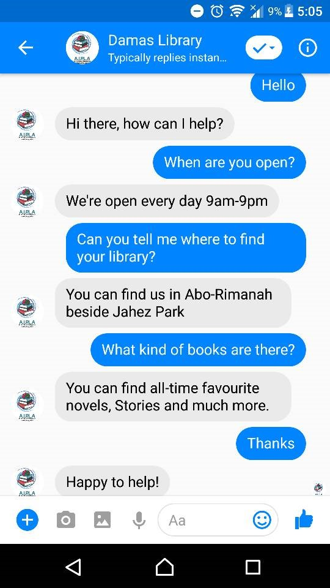
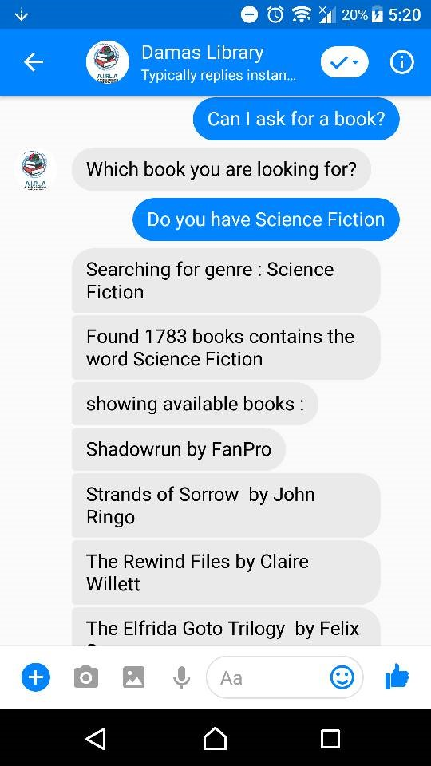

# AIPLA an Artificial Intelligent powered Library Assistant
AIPLA is a Messenger chat-bot using NLP and DL to find, search and recommend books for various users, based on their taste of music and past searches.

## Screenshots
 

